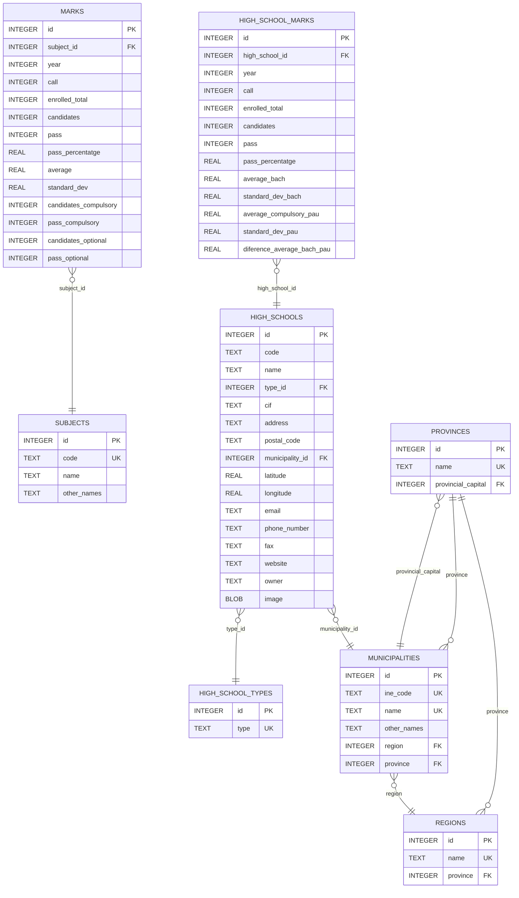

# SQL Files Structure and Export Script

This directory contains files for managing and exporting the Notas-PAU-CV project database.

## Main Files

- **schema.sql**: Database table definitions, including fields, types, and relationships.
- **seed.sql**: Structure plus initial data for main tables. The seed file contains only information related to high-school types and location data (provinces, municipalities, regions).
- **dump.sql**: Full database dump (structure and data), auto-generated for backup or restore.
- **export_db.sh**: Bash script to export the SQLite database. This script only generates `dump.sql` (structure + data) and `schema.sql` (structure only) from the main database file.

## Typical Usage

- Use `schema.sql` to create the database structure, then populate with `seed.sql`.
- Use `dump.sql` to restore or clone the full database.
- Run `export_db.sh` to generate backup files.

## Notes
- All files are for SQLite.
- The directory may include other scripts or data management files.

