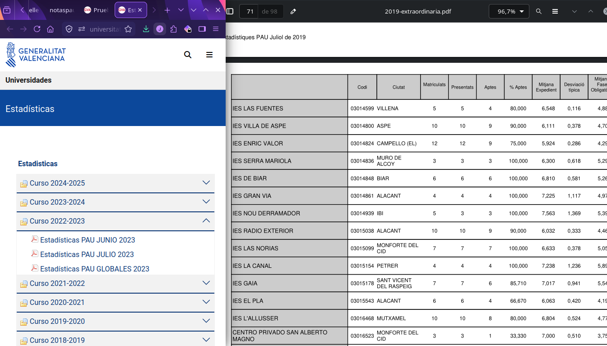

```{r}
#| include: false
knitr::opts_chunk$set(dev.args = list(bg = "transparent"))
```

```{r}
#| file: _modelo1.R
#| include: false
```

## {.center}

::: {.r-fit-text}
9 en bachillerato.

¿9 en la PAU?
:::

## Nos surgen mil preguntas {.center}

::: {.incremental}
- ¿Qué instituto rinde mejor?
- ¿La PAU recorta igual a todos?
- ¿Dónde están los mejores centros?
- ¿Público, concertado o privado?
- ¿Ha mejorado con los años?
- ¿Y mi instituto?
- ¿Qué asignatura es la más difícil?
- ¿Cuál tiene más suspensos?
- ¿Qué asignatura sube más la nota?
:::

## Fuentes de datos {.center}

{.r-stretch fig-align="center"}

## ¿Cómo lo parseamos? {.center}

PDFs oficiales → extracción → base de datos

::: {.columns}
::: {.column width="50%"}
{height="220"}
:::
::: {.column width="50%"}
{height="220"}
:::
:::

## Explóralo tú mismo {.center}

::: {.columns}
::: {.column width="50%"}
{height="260" fig-align="center"}
:::
::: {.column width="50%"}
{height="260" fig-align="center"}
:::
:::

[Abrir la aplicación](https://ribal21-notas-pau-cv.share.connect.posit.cloud){.btn .btn-primary .btn-lg target="_blank"}

> Demo en vivo de la aplicación

## {.center}

::: {.r-fit-text}
¿Por qué unos institutos

rinden más que otros?
:::

# Introducción a la econometría {.center}

*La econometría es una disciplina que combina datos, modelos matemáticos y estadística para analizar fenómenos reales, identificar relaciones entre variables y ayudar a tomar decisiones basadas en evidencia.*

## Definición formal {.smaller}

La econometría combina **teoría económica**, **matemáticas** e
**inferencia estadística** para especificar un modelo, estimar sus
parámetros a partir de datos y contrastar hipótesis sobre las
relaciones entre variables, controlando por factores no observados.


# Datos de panel {.center}

Conjunto de datos que combina dos dimensiones: un **corte transversal**
(varias unidades) y una **serie temporal** (varios periodos).

Es decir, observamos las **mismas unidades** repetidamente
a lo largo del tiempo.

# En nuestro caso {.center}

- **Corte transversal:** los institutos de la Comunitat Valenciana
  *(muchas unidades observadas a la vez)*
- **Serie temporal:** las notas de cada instituto, año tras año
  *(la misma unidad a lo largo del tiempo)*

# Panel


| Instituto             | 2021 | 2022 | 2023 | 2024 | 2025 |
|:----------------------|:----:|:----:|:----:|:----:|:----:|
| IES El Serpis         | 7,1  | 7,3  | 7,5  | 7,4  | 7,6  |
| IES Districte Marítim | 6,8  | 7,0  | 6,9  | 7,1  | 7,2  |
| IES Clara Campoamor   | 7,4  | 7,5  | 7,2  | 7,6  | 7,4  |
| IES Lluís Vives       | 7,8  | 7,6  | 8,0  | 7,9  | 8,1  |
| IES Sorolla           | 6,9  | 7,1  | 7,0  | 7,3  | 7,2  |


# Efectos fijos {.center}

Cada instituto tiene su **propio nivel**, constante en el tiempo.

El modelo le asigna un **intercepto propio** a cada centro: ese número es su ***efecto-centro***.

Resume todo lo que distingue al centro y no cambia a lo largo del tiempo:

- Ubicación
- Cultura de centro
- ...

## ¿Cómo se estima? El *within* {.smaller}

El modelo de efectos fijos para cada centro $i$ y año $t$:

$$\overline{PAU}_{it} = \alpha_i + \beta\,\overline{Bach}_{it} + \varepsilon_{it}$$

Restamos a cada variable la media del propio centro (*transformación within*)
y el efecto-centro $\alpha_i$ se cancela:

$$\overline{PAU}_{it} - \overline{PAU}_{i} = \beta\,(\overline{Bach}_{it} - \overline{Bach}_{i}) + (\varepsilon_{it} - \varepsilon_{i})$$

- Solo queda la variación dentro de cada centro, año a año
- $\beta$ mide cómo, cuando la media de bachillerato sube respecto a lo
  habitual del centro, cambia su nota media de PAU
- Lo que no cambia (p. ej. la titularidad) desaparece y no puede estimarse así

## Estimación de $\beta$ {.smaller}

Mínimos cuadrados (MCO) sobre las variables centradas:

$$\hat\beta = \frac{\sum_{i,t}(\overline{Bach}_{it}-\overline{Bach}_{i})(\overline{PAU}_{it}-\overline{PAU}_{i})}{\sum_{i,t}(\overline{Bach}_{it}-\overline{Bach}_{i})^2}$$

Es la pendiente de la relación *dentro* de cada centro: usa solo cómo se
mueven juntas las desviaciones de bachillerato y de PAU.

## Recuperar el efecto-centro {.smaller}

Una vez estimado $\beta$, despejamos el efecto de cada centro:

$$\hat\alpha_i = \overline{PAU}_{i} - \hat\beta\,\overline{Bach}_{i}$$

Es lo que el centro rinde por encima (o por debajo) de lo esperado
para su nivel de bachillerato.

# Nota media de la PAU {.center}

Efectos fijos (*within*). Los presentados y la variación **no** son
significativos, así que se descartan:

$$\widehat{\overline{\mathrm{PAU}}}_{it} = 0{,}77 \cdot \overline{\mathrm{Bach}}_{it} + \hat\eta_i$$

::: {.smaller}
$i$: instituto · $t$: año · $\overline{\mathrm{Bach}}$: media de bachillerato · $\hat\eta_i$: efecto fijo del centro
:::

## Efectos fijos o aleatorios: Hausman {.smaller}

¿Nos quedamos con **efectos fijos** o **aleatorios**? Lo decide el test de Hausman:

$$H_0:\ \mathrm{Cov}(X_{it},\,\eta_i) = 0$$

- Estadístico $\chi^2 = `r round(hausman_pau$statistic, 2)`$
- *p*-valor $= `r signif(hausman_pau$p.value, 3)`$

Rechazamos $H_0$: la heterogeneidad del centro está correlacionada con los
regresores, así que el modelo aleatorio sería inconsistente → **efectos fijos**.

## Diagnóstico de los errores {.smaller}

¿Son fiables los errores estándar clásicos? Tres contrastes sobre los residuos:

```{r}
knitr::kable(diag_tests)
```

Los tres *p*-valores están **por debajo de 0,05**: hay heterocedasticidad,
autocorrelación temporal y dependencia transversal. Los errores estándar
clásicos no son fiables.

## Corrección robusta de la inferencia {.smaller}

Usamos una matriz de varianzas-covarianzas robusta (*Arellano*, HC1, agrupada
por centro) que corrige heterocedasticidad y autocorrelación intra-centro:

```{r}
fe_pau_robust
```

Ya con la inferencia corregida, solo **`average_bach`** es significativa: los
presentados y la dispersión no lo son y se descartan, dejando la ecuación final.

## Corrección robusta de la inferencia (modelo aleatorio) {.smaller}

```{r}
re_pau_robust
```

Aun corrigiendo los errores estándar, el problema del modelo aleatorio no es la
inferencia, sino el **sesgo**: el test de Hausman ya descartó su supuesto clave.

# Distribución de los efectos fijos {.center}

```{r}
g_histograma
```

# Efecto fijo por Centro {.smaller .smalltitle}

```{r}
dt_eta
```

# Mapa de la Comunitat {.center}

```{r}
m_mapa
```

# Beta-convergencia entre centros {.center}

¿Los centros con peor nota inicial crecen más rápido?

```{r}
g_convergencia
```

# Trayectorias por quintil {.center}

```{r}
g_convergencia_q
```

# Próximos pasos {.center}

::: {.incremental}
- Centro por asignatura *(solicitar datos a la Conselleria GVA/Universidad)*
- Incorporar variables socioeconómicas del entorno del centro
- Modelos dinámicos
- Analizar la brecha por titularidad (público / concertado / privado)
- Explorar el efecto del tamaño del centro y la ratio de presentados
:::

# Sobre los autores {.smalltitle}

::: {.columns}

::: {.column width="50%"}
**Javier Ribal del Río**

Doble grado en ADE e Ingeniería Informática\
*UPV*

- [\@JavierRibaldelRio](https://github.com/JavierRibaldelRio)
- [LinkedIn](https://www.linkedin.com/in/javier-ribal-del-rio/)
:::

::: {.column width="50%"}
**Pau Minguet Micó**

Doble grado en ADE e Ingeniería Informática\
*UPV*

- [\@pminmic](https://github.com/pminmic)
- [LinkedIn](https://www.linkedin.com/in/pau-minguet-mico/)
:::

:::

::: {.center-x style="margin-top: 1.2em; text-align: center; font-size: 0.85em; color: #555;"}
¡Gracias por vuestra atención!
:::
